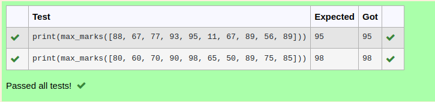
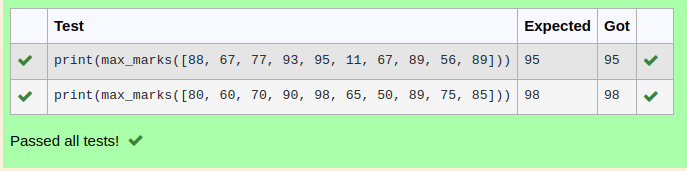
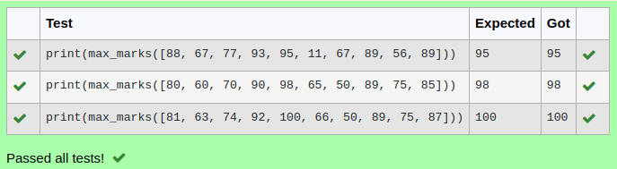

# Find the maximum of a list of numbers
## Aim:
To write a program to find the maximum of a list of numbers.
## Equipment’s required:
1.	Hardware – PCs
2.	Anaconda – Python 3.7 Installation / Moodle-Code Runner
## Algorithm:
1.	Get the list of marks as input
2.	Use the sort() function or max() function or use the for loop to find the maximum mark.
3.	Return the maximum value
## Program:
```
Program to mark the maximum of marks using the list method sort
Developed by: your name:sarvesh.s
RegisterNumber: 22003029
```
i)	# To find the maximum of marks using the list method sort.
## Program:
```
def max_marks(marks):
    marks.sort()
    large = marks[-1]
    return large

```
## output:


ii)	# To find the maximum marks using the list method max().
## Program:
```
def max_marks(marks):
    maxi = max(marks)
    return maxi
```

## Output:


iii) # To find the maximum marks without using builtin functions.
## Program :

```
def max_marks(list1):
    max1 = list1[0]
    for i in list1:
        if i>max1:
         max1=i
    return max1     
```    
## output :



## Result:
Thus the program to find the maximum of given numbers from the list is written and verified using python programming.